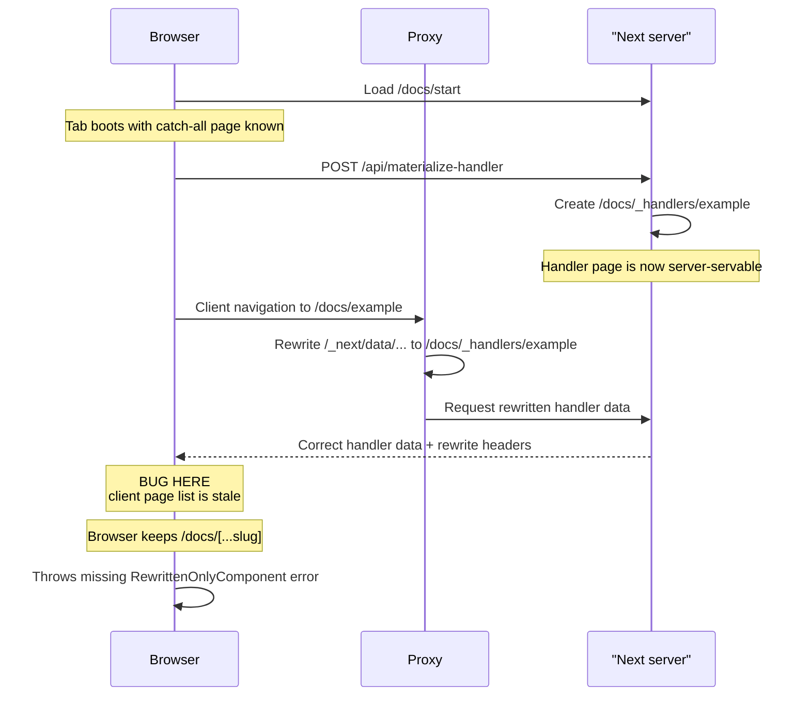

# Next.js Pages Router Client-Stale Manifest Repro

This app reproduces a development-only Pages Router bug where the server can
already serve a rewritten page, but the browser still keeps rendering the
previous catch-all page because the client-side page list is stale.

Scope of this repro:

- Pages Router only
- Development mode only
- Verified with `next dev --turbopack`
- In the installed `next@16.2.1-canary.2`, plain `next dev` also starts with
  Turbopack. This repo still uses `--turbopack` explicitly to remove ambiguity.

## What this repro is targeting

The important condition is not just “a rewrite happened.” The important
condition is:

- the browser booted while only the catch-all page was known
- a handler page such as `/docs/_handlers/example` appears later
- `proxy.ts` rewrites `/docs/example` to `/docs/_handlers/example`
- the server can already serve the rewritten handler page
- but the client router can still keep the catch-all page component

That likely happens because the Pages Router client does two things during a
client-side navigation:

- it reads the rewritten target from the response headers
- it only fully switches to that page if the rewritten route is already present
  in the current client page list

So if `/docs/_handlers/example` is available up front before the browser boots,
navigation usually works:

- the client page list already contains the handler page
- the rewritten target resolves cleanly
- the client loads the correct page component

If `/docs/_handlers/example` appears only after the browser has already loaded
`/docs/start`, this repro tries to trigger the opposite case:

- the server can still already serve the handler page
- the rewrite response can still correctly point at that handler page
- but the client can fail to adopt the rewritten page and keep rendering the
  catch-all component instead

That is the stale client rewrite / stale client manifest case this repo is
trying to make visible.

## Relevant Next client code

When this README says “client page list” or “dev page list,” it is referring to
the Pages Router client code in Next itself:

- `next/dist/client/page-loader.js`
  In development, `getPageList()` reads `window.__DEV_PAGES_MANIFEST.pages`.
- `next/dist/shared/lib/router/router.js`
  During client-side navigation, the router reads the rewrite target from the
  response headers and only fully adopts the rewritten route when it is already
  present in that page list.

This repro is aimed at the case where those client-side assumptions lag behind
the server: the server can already serve `/docs/_handlers/example`, but the
client still behaves as if only `/docs/[...slug]` is available.

This repro also sets `skipProxyUrlNormalize: true` in `next.config.ts`.
That is not the suspected bug. It is only used so `proxy.ts` can still see the
raw client-side `/_next/data/...` request shape before Next normalizes it.
The bug this repo is targeting is later than that: the client can still keep
the catch-all page component even after the rewritten handler route is already
servable.

In pseudocode, the suspect client behavior looks roughly like this:

```ts
pages = pageLoader.getPageList()
rewriteTarget = readRewriteTargetFromResponseHeaders()
resolvedRoute = resolveRewrittenPage(rewriteTarget)

if (pages.includes(resolvedRoute)) {
  // adopt the rewritten page component
} else {
  // keep the previously loaded page component
}
```

This repro is trying to show the bad case where:

- the server can already serve `resolvedRoute`
- but `pages` is still stale in the current browser tab
- so the client keeps `/docs/[...slug]` even though the rewritten handler page
  is already valid on the server

## Bug sequence

This is the narrow sequence this repro is trying to hit:

1. The app is running in **Pages Router development mode**.
2. The browser loads `/docs/start`, so the current tab knows the catch-all page.
3. The handler page does **not** exist yet.
4. The user materializes `/docs/_handlers/example`.
5. The user performs a **client-side navigation** to `/docs/example`.
6. `proxy.ts` rewrites the resulting `/_next/data/...` request to
   `/docs/_handlers/example`.
7. The server can already serve the rewritten handler page and returns the
   correct data.
8. **Bug:** the client still keeps the previously loaded catch-all page
   component because its current dev page list is stale.
9. The catch-all page tries to render rewritten handler data and throws
   `Expected component 'RewrittenOnlyComponent' to be defined`.



## Why the thrown error is meaningful

The generated handler pages statically import
`RewrittenOnlyComponent`, but the catch-all page does not.

So when the browser throws:

`Expected component 'RewrittenOnlyComponent' to be defined`

that is not a random rendering bug. It means:

- the rewritten handler data was used
- but the catch-all page component was still rendering

That is exactly the failure shape we want to show.

## Run

```bash
cd /Users/markusgritsch/Development/Topics/Millipede/Project/OSS-Projects/bug-report-rewrite-client-stale
pnpm install
pnpm dev
```

Use the actual port printed by `next dev` if `3000` is already in use.

## Repro steps

1. Open `/docs/start`
2. Confirm the handler route is shown as `missing`
3. Click `Materialize example`
4. Click `Go to example`

Expected failing signals:

- proxy logs a rewrite from `/docs/example` to `/docs/_handlers/example`
- the server can already serve `/docs/_handlers/example`
- the first client-side transition can still fail with
  `Expected component 'RewrittenOnlyComponent' to be defined`

## Resetting the repro

`Reset handlers` deletes the generated handler page. After that, proxy stops
rewriting `/docs/example`.

For the cleanest retry of the exact first-hit scenario:

1. Click `Reset handlers`
2. Restart `pnpm dev`
3. Open `/docs/start` again

## Control case

If the generated handler pages already exist before the browser session starts,
the first client-side navigation should usually succeed. That is an important
part of the bug theory: when the handler page is already present in the client
page list up front, the rewritten route is adopted correctly.
